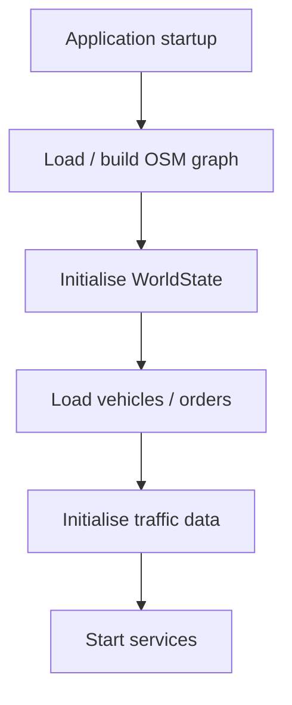

# Agentic Supply Chain Platform

An agentic logistics control tower for Singapore that combines natural-language order intake, deterministic vehicle compatibility, graph-based routing, fleet optimisation, traffic awareness, simulation, and operational state management.

The core principle is:

> **The LLM decides what needs to happen; deterministic services decide how it actually happens.**

## Setup

### Prerequisites

Install the following before running the platform:

* Python 3.12+ recommended
* Node.js 20+ for the frontend
* Git
* An OpenStreetMap/OSMnx-compatible environment
* API credentials for any external services being used, such as:
    * LTA DataMall
    * OneMap

### 1. Clone the repository

```bash
git clone https://github.com/b1-ing/agentic-supply-chain-platform
cd agentic-supply-chain-platform
```

### 2. Create the Python environment

Create a virtual environment:

```bash
python -m venv .venv
```

Activate it:

**Windows**

```powershell
.venv\Scripts\activate
```

**Linux / macOS**

```bash
source .venv/bin/activate
```

### 3. Install backend dependencies

Install the dependencies from `requirements.txt`:

```bash
pip install -r requirements.txt
```

The main backend dependencies include:

* FastAPI
* Uvicorn
* Pydantic
* NetworkX
* OSMnx
* OR-Tools
* Shapely
* python-dotenv

### 4. Configure environment variables

Create a `.env` file in the project root.

Example:

```env
LTA_API_KEY=<your-lta-api-key>
TOMTOM_API_KEY=<your-tomtom-api-key>
ONEMAP_EMAIL=<your-onemap-email>
ONEMAP_PASSWORD=<your-onemap-password>
```


### 5. Initialise the WorldState

The application initialisation layer is responsible for constructing the operational world.

The general startup process is:




If a cached Singapore road graph is available, it should be loaded rather than rebuilt on every startup.

For example:

```text
cache/
└── singapore.graphml
```

The graph should contain the routing attributes required by the routing services, particularly:

```text
travel_time
length
name
ref
```

along with any relevant vehicle-restriction metadata.

### 6. Start the backend

From the project root, start the FastAPI application:

```bash
python app/main.py
```

```text
GET /api/world
GET /api/routes
GET /api/routes/{vehicle_id}
POST /api/agent
```

The backend is responsible for:

* Maintaining `WorldState`
* Processing agent requests
* Managing orders
* Evaluating vehicle compatibility
* Performing graph routing
* Running fleet optimisation
* Persisting routes
* Processing traffic information
* Exposing operational state through the API

### 7. Start the frontend

Clone the frontend repository as follows and follow the instrution in that repository's README:

```bash
git clone https://github.com/b1-ing/agentic-supply-chain-dashboard
cd agentic-supply-chain-dashboard
```

The frontend connects to the FastAPI backend and provides the map-based control tower.

It displays operational information including:

* Vehicles
* Orders
* Pickup locations
* Delivery locations
* Active routes
* Route geometry
* Traffic information
* Direction indicators

The frontend uses React/Next.js and React Leaflet.

The frontend is hot swappable, you can replace it with any front end of your choice.

### 8. Verify the system

After starting both services, verify that:

```text
Backend
   |
   +-- FastAPI starts successfully
   +-- WorldState is initialised
   +-- Singapore road graph is available
   +-- Vehicles are loaded
   +-- API responds
   |
   v
Frontend
   |
   +-- Next.js starts successfully
   +-- Backend connection succeeds
   +-- Map renders
   +-- Vehicles appear
   +-- Routes can be displayed
```

A basic API check can be performed by opening:

```text
/api/world
```

The response should contain the current operational WorldState, including vehicles, orders, traffic events, and routes.

### 9. Test the end-to-end agentic workflow

A representative test request is:

```text
Deliver 10kg cold fish from Bukit Timah Plaza
to Clementi Mall. Avoid PIE.
```

The expected pipeline is:

```text
Natural-language request
        |
        v
Operations Agent
        |
        v
Order assessment
        |
        v
Order creation
        |
        v
Geocoding
        |
        v
Graph snapping
        |
        v
Compatibility
        |
        v
Routing strategy
        |
        v
Graph routing
        |
        v
VehicleRoute
        |
        v
WorldState.routes
        |
        v
FastAPI
        |
        v
Frontend control tower
```

The expected operational result is:

* The order is recognised as refrigerated.
* A compatible vehicle is selected.
* `PIE` is represented as `avoid_road`.
* Matching PIE edges are removed from the temporary routing graph.
* A graph-based route is calculated.
* Route geometry is generated.
* The route is persisted in `WorldState.routes`.
* The order moves from `new_orders` to `orders_in_progress`.
* The vehicle becomes `EN_ROUTE`.
* The frontend displays the resulting route.

### 10. Running the development environment

The normal development setup therefore consists of two processes:

**Backend:**

```bash
uvicorn main:app --reload
```

**Frontend:**

```bash
cd frontend
npm run dev
```

The backend acts as the operational control layer, while the frontend provides the control-tower visualisation.

For development, the overall system is:

```text
                  User
                    |
                    v
             Next.js Frontend
                    |
                    v
               FastAPI API
                    |
                    v
           Operations Agent
                    |
                    v
              WorldState
             /     |      \
            /      |       \
        Orders  Traffic   Vehicles
            \      |       /
             \     |      /
                  Routing
                    |
          +---------+---------+
          |                   |
     Graph Routing         OR-Tools
          |                   |
          +---------+---------+
                    |
                    v
              VehicleRoute
                    |
                    v
              WorldState
                    |
                    v
             Frontend Map
```


---

## Architecture

```text
User
 |
 v
Operations Agent
 |
 +--> Order assessment
 +--> Order creation
 +--> Compatibility
 +--> Routing strategy
 +--> World observation
 |
 v
WorldState
 |
 +-----------------------------+
 |                             |
 v                             v
Order / Geocoding          Traffic / Disruptions
 |                             |
 v                             v
RoutingProblemBuilder      Rerouting
 |
 v
MatrixService
 |
 v
ORToolsSolver
 |
 v
RouteBuilder
 |
 v
RoutePlan / VehicleRoute
 |
 v
WorldState.routes
 |
 v
FastAPI
 |
 v
Frontend Control Tower
```

`WorldState` is the authoritative operational state. Routes, vehicles, orders, traffic events, and routing information should not have separate competing sources of truth.

---

## Order Lifecycle

A natural-language request follows the general pipeline:

```text
Natural-language request
        |
        v
Order assessment
        |
        v
Order creation
        |
        v
Geocoding
        |
        v
Graph snapping
        |
        v
Vehicle compatibility
        |
        v
Routing strategy
      /   \
     /     \
 SIMPLE    CVRP
    |        |
    v        v
Graph      OR-Tools
routing    optimisation
     \      /
      \    /
       v  v
    VehicleRoute
        |
        v
   WorldState
```

Orders whose pickup or delivery locations cannot be geocoded or snapped to the road graph must not proceed into routing.

---

## Geocoding and Location Resolution

Location resolution has a deliberate fallback path.

The system does **not** require every location to already exist as a hard-coded graph location.

For natural-language routing, `SimpleRoutingTool.route()` first attempts to resolve the requested place from locations already known to `WorldState`, including addresses associated with existing and new orders.

If the location cannot be resolved locally, the routing tool falls back to the geocoding tool:

```text
Requested place
      |
      v
Known WorldState location?
      |
   +--+--+
   |     |
  yes    no
   |     |
   v     v
Use     geocode_location()
known         |
location      v
          coordinates
              |
              v
       OSMnx nearest_nodes()
              |
              v
        RoutingLocation
              |
              v
        Graph routing
```

### Important distinction

**Geocoding and routing are separate responsibilities.**

The geocoder resolves a place name into coordinates.

The routing layer then converts those coordinates into a graph node and calculates the route using the OSM road graph.

For example:

```text
"DSTA"
   |
   v
geocode_location()
   |
   v
(latitude, longitude)
   |
   v
OSMnx nearest_nodes()
   |
   v
graph_node
   |
   v
NetworkX shortest path
```

This means natural-language routing can work even when the requested place was not previously stored in `WorldState`.

### Order geocoding

The order pipeline performs the same conceptual operation for pickup and delivery addresses:

```text
pickup_address
      |
      v
geocode
      |
      v
pickup_lat / pickup_lon
      |
      v
nearest graph node
      |
      v
pickup_node
```

and similarly for delivery.

A failed geocode or graph snap is a terminal failure for that routing attempt. A partially resolved order should not be passed to the routing solver.

---

## Routing Architecture

The routing stack is deliberately separated into levels.

### Low-level routing

```python
route_locations()
```

Routes already-resolved `RoutingLocation` objects.

It:

- validates graph nodes
- resolves required waypoints
- calculates shortest paths
- applies supported routing constraints
- extracts graph geometry
- returns distance and travel time

It does **not**:

- assign vehicles
- modify orders
- decide simple vs CVRP
- perform fleet optimisation

### Natural-language routing

```python
route()
```

Accepts place names and performs location resolution before graph routing.

Its resolution path is:

1. Try known locations in `WorldState`
2. Fall back to `geocode_location()`
3. Convert geocoded coordinates to the nearest OSMnx graph node
4. Route on `WorldState.graph`

### Operational single-order routing

```python
simple_fleet_route()
```

Handles:

1. Order lookup
2. Compatibility evaluation
3. Vehicle selection
4. Routing locations
5. Routing constraints
6. Vehicle → pickup
7. Pickup → delivery
8. Delivery → vehicle
9. Route construction
10. WorldState commitment

A successful route moves the order from:

```text
world.new_orders
        |
        v
world.orders_in_progress
```

and commits the route to both the vehicle and `WorldState.routes`.

### Fleet optimisation

```python
plan_routes()
```

Delegates joint fleet planning to the routing service.

### Strategy selection

```python
decide_routing_strategy()
```

determines whether the current WorldState calls for simple routing or joint fleet optimisation.

---

## Graph-Based Routing

The current operational routing path is graph-based.

The primary routing graph is:

```text
WorldState.graph
      |
      v
OSMnx / NetworkX
      |
      v
shortest_path(..., weight="travel_time")
```

OneMap remains available as an external routing/geospatial integration, but it is **not the primary route calculation path for the current graph-based simple/fleet routing flow**.

### Graph route output

Graph routing returns:

```text
nodes
geometry
distance_m
travel_time_s
routing_mode
constraints
```

Geometry is extracted from OSM edge geometries where available, with node-coordinate fallback for edges without explicit geometry.

Backend geometry uses:

```text
[longitude, latitude]
```

Leaflet uses:

```text
[latitude, longitude]
```

The frontend therefore converts backend geometry before rendering a `Polyline`.

---

## Constraint-Aware Routing

Routing constraints are operational data.

Supported concepts include:

```text
avoid_road
avoid_area
required_road
required_area
required_waypoint
max_route_time
max_route_distance
minimize_unnecessary_delay
```

Singapore expressway abbreviations are treated as roads when explicitly requested:

```text
PIE
AYE
KJE
BKE
CTE
ECP
KPE
MCE
SLE
TPE
```

For example:

```text
avoid_road = PIE
```

must not be converted into:

```text
avoid_area = PIE
```

### Road restrictions

Graph-based constrained routing temporarily copies the routing graph and removes matching edges before calculating the shortest path.

Road identifiers are checked against OSM:

```text
name
ref
```

The route can therefore enforce requests such as:

```text
avoid PIE
avoid MCE
avoid Braddell Flyover
```

### Area restrictions

Area-based restrictions currently require geographic polygons for robust enforcement.

Until polygon matching is implemented, unresolved area constraints are explicitly reported rather than silently pretending they were enforced.

---

## Compatibility and Fleet Routing

Vehicle compatibility is evaluated before an order enters routing.

The result is represented by:

```text
CompatibilityResult
├── order_id
├── compatible
├── incompatible
├── allowed_vehicle_indices
└── status
    ├── ROUTABLE
    ├── WAITING
    └── UNSERVICEABLE
```

Meaning:

- `ROUTABLE` — the order can proceed to routing.
- `WAITING` — the order currently has no usable vehicle assignment.
- `UNSERVICEABLE` — the order cannot currently be served.

Fleet-wide routing uses OR-Tools with:

- vehicle-specific starts and ends
- vehicle capacities
- travel-time costs
- time dimension
- pickup/delivery pairing
- pickup-before-delivery precedence
- compatibility-based allowed vehicles

---

## CVRP Pipeline

The fleet-routing pipeline is:

```text
WorldState
    |
    v
RoutingProblemBuilder
    |
    +-- vehicles
    +-- locations
    +-- starts / ends
    +-- demands / capacities
    +-- pickup-delivery pairs
    |
    v
MatrixService
    |
    v
TravelMatrix
    |
    v
ORToolsSolver
    |
    v
Raw vehicle routes
    |
    v
RouteBuilder
    |
    v
RoutePlan
    |
    v
VehicleRoute
```

### RoutingProblemBuilder

`RoutingProblemBuilder` converts the operational world into a solver-ready problem.

It builds:

- vehicles
- routing locations
- vehicle starts
- vehicle ends
- demands
- capacities
- pickup/delivery pairs

### MatrixService

`MatrixService` computes an `NxN` travel-time matrix over the supplied `RoutingLocation` objects.

For each source location it runs shortest-path distance calculations against:

```text
weight="travel_time"
```

Unreachable locations receive an infinite matrix value.

### ORToolsSolver

The solver consumes:

```text
matrix
starts
ends
demands
capacities
pickup_delivery_pairs
```

and produces raw vehicle route sequences.

### RouteBuilder

`RouteBuilder` converts the raw solver output into domain objects:

```text
RoutePlan
  |
  +-- VehicleRoute
       |
       +-- RouteStop
       +-- RouteSegment
```

Route segments contain detailed graph geometry and accumulated distance/travel time.

---

## Route Persistence

A successful routing operation is not complete until the route is persisted.

Expected state:

```text
WorldState.routes
    |
    +-- VehicleRoute
         +-- route_id
         +-- vehicle_id
         +-- stops
         +-- segments
         +-- total_distance
         +-- total_travel_time

Vehicle
    |
    +-- current_route_id
    +-- current_route
    +-- status = EN_ROUTE
```

For a successfully routed order:

```text
new_orders
     |
     | route committed
     v
orders_in_progress
```

This allows:

- the simulator to find the active route
- the frontend to display it
- `/api/world` to expose it
- `/api/routes` to expose it
- disruption services to find it
- active-order modification to reroute it

A route that exists only as a local variable is insufficient.

---

## Traffic and Disruptions

Traffic incidents are represented by:

```text
TrafficIncident
├── incident_id
├── source
├── type
├── severity
├── description
├── road_name
├── latitude
├── longitude
├── start_time
├── end_time
└── metadata
```

Incident types include:

```text
accident
roadworks
heavy_traffic
road_closure
vehicle_breakdown
flood
event
hazard
other
```

Active incident queries compare timestamps using timezone-aware UTC datetimes.

The intended disruption flow is:

```text
Traffic incident
      |
      v
Find affected active routes
      |
      v
Identify vehicle
      |
      v
Preserve current vehicle position
      |
      v
Preserve remaining stops
      |
      v
Rebuild route
      |
      v
WorldState.routes
```

The same rerouting mechanism is intended to support:

- traffic disruption
- active-order modification
- vehicle failure
- manual rerouting

---

## FastAPI API

Important operational endpoints include:

```text
GET /api/world
GET /api/routes
GET /api/routes/{vehicle_id}
```

`/api/world` exposes the operational state, including:

```text
summary
vehicles
traffic_events
depots
new_orders
orders_in_progress
cancelled_orders
unserviceable_orders
routes
```

Route responses expose:

```text
route_id
vehicle_id
stops
segments
total_distance
total_travel_time
```

Route geometry is exposed to the frontend so that the control tower can render the active route.

---

## Frontend

The frontend provides a map-based operational view using React/Next.js and React Leaflet.

The map can display:

- vehicles
- pickup stops
- delivery stops
- routes
- route geometry
- direction indicators
- traffic information

Backend geometry:

```text
[lon, lat]
```

Frontend Leaflet positions:

```text
[lat, lon]
```

Therefore route geometry must be converted before being passed to:

```tsx
<Polyline positions={positions} />
```

---

## Project Structure

```text
agentic-supply-chain-platform/
|
├── agents/
│   ├── operations_agent.py
│   └── tools/
│       ├── order_tools.py
│       ├── routing_tools.py
│       ├── geocoding_tools.py
│       └── ...
│
├── api/
│   ├── routes/
│   │   ├── agent.py
│   │   ├── world.py
│   │   ├── vehicles.py
│   │   ├── orders.py
│   │   ├── routes.py
│   │   └── depots.py
│   └── schemas/
│
├── models/
│   ├── order/
│   ├── routing/
│   ├── vehicles/
│   ├── traffic/
│   └── world/
│
├── services/
│   ├── world/
│   ├── routing/
│   ├── traffic/
│   ├── simulation/
│   └── ...
│
├── app/
│   └── initialise.py
│
└── README.md
```

---

## Technology Stack

### Backend

- Python
- FastAPI
- Pydantic
- NetworkX
- OSMnx
- OR-Tools
- Shapely

### Routing / Mapping

- OpenStreetMap
- OSMnx / NetworkX
- OneMap geocoding/routing integration
- Singapore-specific geospatial processing

### Traffic

- LTA DataMall
- TomTom traffic data
- traffic incident processing
- road/area matching

### Frontend

- React
- Next.js
- React Leaflet
- map-based operational visualisation

---

## Operational Principles

### WorldState is authoritative

Do not maintain a separate source of truth for routes, vehicles, or orders inside individual services.

### Planning and execution are separate

Routing determines what a vehicle should do. Simulation executes the planned route.

### LLMs do not compute routes

The agent decides:

- what the user wants
- which tools should be called
- whether simple routing or fleet optimisation is appropriate
- whether a disruption requires replanning

Deterministic services handle:

- geocoding
- graph snapping
- compatibility
- graph routing
- constraint enforcement
- route construction
- fleet optimisation
- WorldState mutation

### Failed location resolution stops routing

An order with a failed pickup/delivery geocode or missing graph node must not enter the routing problem.

### Rerouting preserves operational progress

Rerouting starts from the vehicle's current operational position and preserves uncompleted stops. It does not restart the vehicle from the depot.

### Routes are persisted

New and rebuilt routes must be stored in `WorldState.routes`.

---

## Demonstration Flow

A representative end-to-end demonstration is:

```text
"Deliver 10kg cold fish from Bukit Timah Plaza
to Clementi Mall. Avoid PIE."
```

Expected pipeline:

```text
Natural-language order
        |
        v
Assessment
        |
        v
Order creation
        |
        v
Geocoding
        |
        v
Graph snapping
        |
        v
Compatibility
        |
        v
Simple routing
        |
        v
Graph route with PIE restriction
        |
        v
VehicleRoute
        |
        v
WorldState
        |
        v
Frontend route display
```

Expected operational result:

- order is recognised as refrigerated
- compatible refrigerated vehicle is selected
- `PIE` is represented as `avoid_road`
- graph routing removes matching PIE edges
- route geometry is generated from the graph
- route is persisted
- order moves from `new_orders` to `orders_in_progress`
- vehicle becomes `EN_ROUTE`
- frontend displays the route

For multiple genuinely unassigned orders, the strategy can transition to CVRP:

```text
Multiple unassigned orders
        |
        v
RoutingProblemBuilder
        |
        v
MatrixService
        |
        v
ORToolsSolver
        |
        v
Fleet-wide routes
```

---

## Current Limitations / WIP

The platform is still a research/prototyping system.

Current areas of work include:

- polygon-based area constraints
- traffic-triggered automatic replanning
- more complete time-window handling
- richer vehicle constraints
- persistent production-grade state management
- simulation robustness
- scalable routing matrix computation
- deeper fleet-routing evaluation
- rolling-horizon dynamic VRP experiments

The current graph-based routing path is the primary operational routing implementation.

---

## Design Principle

> **Observe → Assess → Plan → Execute → Observe again**

The long-term goal is a live agentic control tower that continuously converts changing operational information into feasible fleet decisions.
